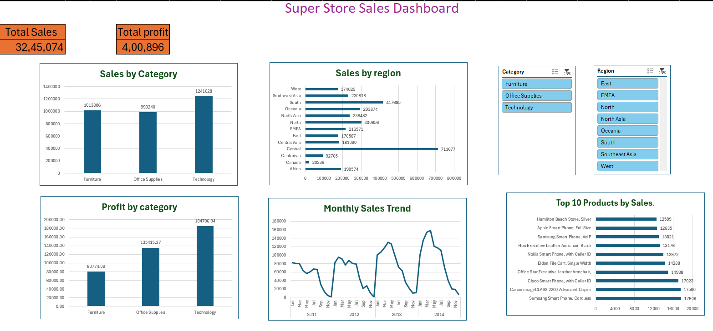

# SuperStore Sales Dashboard

## Project Overview
This project is an interactive Sales Dashboard created in Microsoft Excel using Pivot Tables, Pivot Charts, Slicers, and GETPIVOTDATA formulas.

## Features
- Interactive Dashboard
- Sales by Category
- Sales by Region
- Profit by Category
- Monthly Sales Trend
- Top 10 Products by Sales
- Dynamic Slicers (Category and Region)
- KPI Cards for Total Sales and Total Profit

## Tools Used
- Microsoft Excel
- Pivot Tables
- Pivot Charts
- Slicers
- GETPIVOTDATA
- Excel Formulas

## Dashboard Preview

## Files Included
- Super Store Sales Dashboard.xlsx
- Dashboard.png
- README.md
- LICENSE

## Author
**Swarna Priya**
